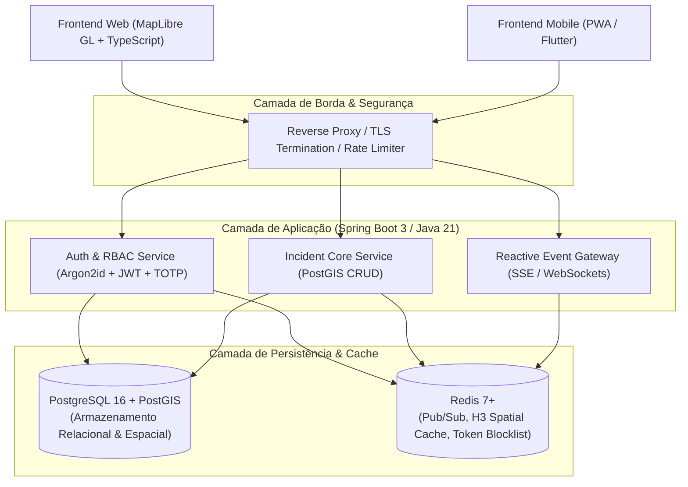

# Vetor Urbano - Plataforma de Resiliência Urbana e Geomonitoramento de Incidentes

> **Status do Projeto:** `v0.3.0-alpha` (Estruturação do Frontend Web e Design System em Andamento)  
> **Modelo de Engenharia:** Full-Cycle Development com IA Pareada (Pair Programming Assistido)  
> **Licença:** Privada / Portfólio Estratégico de Engenharia de Software  

---

## 1. Visão do Produto & Proposta de Valor

O **Vetor Urbano** é uma plataforma corporativa e cívica voltada ao monitoramento georreferenciado de incidentes urbanos, acidentes viários, desastres climáticos (alagamentos, desmoronamentos) e operações de segurança pública em tempo real.

O projeto une a experiência operacional e de gestão de contingências críticas do autor com engenharia de software de alta performance, aplicando processamento espacial (PostGIS), transmissão reativa de eventos em baixa latência e controle de acesso estrito com conformidade à LGPD.

### 1.1. Escopo Geográfico do MVP
* **Região:** Região Metropolitana do Rio de Janeiro (RMRJ).
* **Foco Territorial:** Município do Rio de Janeiro e Baixada Fluminense (Duque de Caxias, Nova Iguaçu, Belford Roxo, São João de Meriti, Nilópolis, Mesquita, Magé, Guapimirim, Queimados, Japeri, Paracambi, Seropédica e Itaguaí).
* **Envelope Bounding Box (EPSG:4326):** `ST_MakeEnvelope(-43.9000, -23.1000, -42.9500, -22.4500, 4326)`.

---

## 2. Changelog & Histórico de Versões

| Versão | Data | Marco / Entregáveis | Status |
| :--- | :--- | :--- | :--- |
| **`v0.1.0-alpha`** | 2026-09-24 | Inception do Produto: Definição de escopo PO, revisão crítica de arquitetura (RF01-RF11, RNF01-RNF11, RN-GEO, RN-MT, RN-AD), mitigação de gargalos de escalabilidade e criação do repositório base. | **Concluído** |
| **`v0.2.0-alpha`** | 2026-09-24 | DBA & Modelagem Espacial: Esquema 3NF PostgreSQL 16 + PostGIS, migração Flyway inicial (`V1__Initial_Schema.sql`), índices espaciais GiST, tipos ENUM e auditoria. | **Concluído** |
| **`v0.3.0-alpha`** | 2026-09-24 | Frontend & UX/UI Base: Inicialização do SPA Angular 19 (`vetor-urbano-web`), integração com Bootstrap (Dark Mode), Angular CDK, MapLibre GL JS (WebGL / Dark Map) e identidade visual Industrial Brutalism. | **Em Andamento** |
| `v0.4.0-alpha` | A definir | Core Backend: API RESTful Java 21+ / Spring Boot 3 com Spring Security, Argon2id, JWT/MFA e endpoints espaciais. | Planejado |
| `v0.5.0-alpha` | A definir | Eventos em Tempo Real: Gateway SSE/WebSockets com Pub/Sub para alertas de risco e geofencing via células H3. | Planejado |
| `v0.6.0-alpha` | A definir | Frontend Cartográfico Avançado: Aplicação Web com MapLibre GL / Vector Tiles e painel operacional de moderação. | Planejado |
| `v1.0.0-rc` | A definir | Homologação de Produção: Harness automatizado, testes de carga, auditoria OWASP e esteira de CI/CD. | Planejado |

---

## 3. Matriz de Requisitos (Revisão Arquitetural)

### 3.1. Requisitos Funcionais (RF)

- **RF01 - Registro Georreferenciado de Incidentes:** Cadastro de ocorrências com ponto geodésico (WGS84 `EPSG:4326`), severidade, categoria, horário e anexos com sanitização de metadados.
- **RF02 - Visualização Cartográfica & Filtros:** Renderização em mapa interativo via MapLibre GL com clustering dinâmico e mapa de calor (Heatmap) filtrado por raio espacial (`ST_DWithin`) e tempo.
- **RF03 - Alertas Proativos por Cerca Virtual (Geofencing Espacial):** Disparo de notificações de entrada em áreas de risco através de partições espaciais (Células H3 / Geohash) desacopladas de rastreamento contínuo de usuários (preservação de bateria e privacidade).
- **RF04 - Validação Comunitária & Algoritmo de Decaimento:** Confirmação/votação comunitária ("Ainda ocorrendo", "Via liberada", "Falso") com Máquina de Estados Finita (FSM) e decaimento temporal exponencial (*Half-Life decay*).
- **RF05 - Roteamento Inteligente & Verificação de Intersecção:** Detecção de colisão espacial entre rotas planejadas (LineString) e perímetros de incidentes graves (Polygons/Buffers), sugerindo desvios operacionais.
- **RF06 - Controle de Acesso Baseado em Funções (RBAC):** Níveis de permissão granulares para `CITIZEN` (Cidadão), `OPERATOR` (Operador de Triagem) e `MANAGER` (Gestor de Crise / Admin).
- **RF07 - Gestão de Operadores e Credenciais:** Painel administrativo do Gestor para provisionamento, ativação, revogação e auditoria de contas operacionais.
- **RF08 - Moderação de Incidentes em Tempo Real:** Fila operacional de atendimento e moderação de ocorrências para validar seriedade, descartar trotes e alterar status de eventos.
- **RF09 - Mancha Térmica Dinâmica (Heatmap por Categoria):** Alternância instantânea entre marcadores (pins) e mancha térmica com interpolação WebGL, ponderada por severidade e decaimento temporal.
- **RF10 - Camada de Áreas Conflagradas / Dominadas:** Sobreposição cartográfica de polígonos delimitadores de territórios sob influência de grupos armados (CV, TCP, ADA, Milícia, Disputa) no RJ e Baixada.
- **RF11 - Ingestão de Dados Cartográficos Vetoriais:** Pipeline para importação, sanitização topológica (`ST_IsValid`) e persistência de arquivos vetoriais em formato XML/KML/GeoJSON.

### 3.2. Requisitos Não-Funcionais (RNF)

- **RNF01 - Latência de Resposta Espacial:** Consultas geográficas em raio de 5 km com tempo de resposta de API $\le 300\text{ms}$ e renderização no cliente $\le 1,5\text{s}$ em 4G, suportado por índices `GiST` no PostgreSQL.
- **RNF02 - Privacidade e Anonimização (LGPD & Zero-Trust):** Desacoplamento criptográfico irreversível entre denúncias criminais anônimas e identidades de usuários. Remoção mandatória de metadados EXIF em fotos.
- **RNF03 - Alta Disponibilidade (HA 99,9%):** Resiliência da camada de ingestão e failover com persistência transacional ACID.
- **RNF04 - Escalabilidade Concorrente (20.000 Conexões):** Distribuição assíncrona de eventos via Server-Sent Events (SSE) / WebSockets utilizando barramento reativo com Redis Pub/Sub, evitando esgotamento de threads no backend.
- **RNF05 - Performance Cartográfica (30+ FPS):** Renderização vetorial acelerada por hardware (WebGL/Canvas) com decodificação de Mapbox Vector Tiles (MVT).
- **RNF06 - Criptografia de Credenciais:** Derivação segura de senhas via **Argon2id** com salt criptográfico único por usuário.
- **RNF07 - Gestão e Revogação Imediata de Sessão:** Tokens de curta duração (15 minutos) com rotação de Refresh Token e lista de revogação imediata (*blocklist*) armazenada em memória rápida (Redis).
- **RNF08 - Autenticação Multifator Obrigatória (MFA):** Exigência de TOTP (RFC 6238 via Google Authenticator/Authy) para perfis de alta criticidade (`MANAGER`).
- **RNF09 - Desempenho de Shader WebGL ($\le 250\text{ms}$):** Renderização da camada térmica inteiramente na GPU sem bloqueio do thread da interface.
- **RNF10 - Indexação e Simplificação de Polígonos ($\le 50\text{ms}$):** Suporte a polígonos complexos via `ST_SimplifyPreserveTopology` e indexação `GiST` para testes rápidos de contenção.
- **RNF11 - Validação $O(1)$ de Limites do MVP:** Bloqueio de coordenadas fora do Bounding Box metropolitano na camada de borda.

---

## 4. Arquitetura Alvo & Stack Tecnológica



### 4.1. Estrutura do Repositório (Monorepo)

O projeto é organizado como um monorepo com módulos desacoplados para backend e frontend:

```text
Vetor Urbano/
├── vetor-urbano-api/        # Backend em Java 21 / Spring Boot 3 & Migrações Flyway (PostGIS)
│   └── src/main/resources/db/migration/
├── vetor-urbano-web/        # Frontend SPA em Angular 19, MapLibre GL e Bootstrap/CDK
│   ├── src/app/
│   ├── angular.json
│   └── package.json
├── docs/specs/              # Especificações arquiteturais formais (SPEC-001)
├── planejamento/            # Relatórios e análises de modelagem e arquitetura
├── harness/                 # Scripts determinísticos de verificação e qualidade
├── AGENTS.md                # Diretrizes operacionais e de engenharia para IAs pareadas
└── README.md                # Documentação executiva e técnica do projeto
```

---

## 5. Harness de Verificação & Qualidade

O projeto adota o protocolo de **Zero-Regression Harness**. Nenhuma alteração é promovida sem aprovação estrita nas seguintes camadas:

1. **Static Analysis & Linting:** Checkstyle/Spotless (Java), ESLint/Prettier (TypeScript/React), SQLFluff (SQL).
2. **Type Safety & Compilation:** `mvn test-compile` e `tsc --noEmit` sem warnings tolerados.
3. **Automated Testing Suite:**
   - Testes Unitários de Domínio e Serviços (JUnit 5 + Mockito + AssertJ).
   - Testes de Integração de Repositórios Espaciais via **Testcontainers** (instância real de PostgreSQL + PostGIS em container efêmero).
   - Testes de Contrato de API (OpenAPI / MockMvc).
4. **Security Vulnerability Auditing:** Verificação contínua contra vulnerabilidades OWASP via `dependency-check` e `npm audit`.

Para executar a verificação completa do harness localmente:
```bash
./harness/verify.sh
```

---

## 6. Fluxo de Trabalho do Engenheiro Full-Cycle com IA

Como desenvolvedor Full-Cycle pareado com IA, o ciclo de trabalho segue a seguinte disciplina:
1. **Inception & Arquitetura (PO & Architect):** Especificação formal com mitigação prévia de gargalos e riscos regulatórios. *(Etapa Atual)*
2. **Modelagem de Dados (DBA):** Definição manual assistida de esquemas DDL normatizados (3NF) e índices espaciais, validados em banco de dados real.
3. **Desenho de Contratos e Wireframes (UX/UI):** Especificação de payloads REST/JSON e fluxos de navegação acessíveis (WCAG AA).
4. **Implementação de Backend (Backend Engineer):** Codificação com tipagem estrita, Clean Architecture / DDD pragmático e testes automatizados.
5. **Implementação de Frontend (Frontend Engineer):** Componentização atômica, consumo de contratos tipados e renderização cartográfica de alta performance.
6. **Operação e Resiliência (DevOps & SRE):** Harness de validação contínua, dockerização e observabilidade.
