# Pipeline de Engenharia & Roadmap - Vetor Urbano

> **Documento:** Pipeline de Execução Full-Cycle e Roadmap Técnico  
> **Status Atual:** `v0.3.0-alpha` (Estruturação do Frontend Web e Design System em Andamento)  
> **Modelo de Engenharia:** Full-Cycle Development orientado a arquitetura corporativa e mentoria estratégica  

---

## 1. Visão do Produto & Escopo do Projeto

O **Vetor Urbano** é uma plataforma corporativa e cívica de missão crítica voltada para o monitoramento georreferenciado e gestão de resiliência urbana em tempo real (incidentes de trânsito, criminalidade armada, desastres climáticos e operações de segurança pública).

O projeto atua como a validação prática da transição profissional do autor para a engenharia de software de alta exigência, unindo experiência sólida prévia em **liderança operacional e gestão de crises** (Grupo UNICAD) a competências técnicas avançadas: computação espacial de alto desempenho, arquitetura distribuída de baixa latência, conformidade com a LGPD e segurança defensiva (Zero-Trust).

### 1.1. Delimitação Territorial do MVP
* **Região Polo:** Região Metropolitana do Rio de Janeiro (RMRJ).
* **Foco Inicial:** Município do Rio de Janeiro e Baixada Fluminense (Duque de Caxias, Nova Iguaçu, Belford Roxo, São João de Meriti, Nilópolis, Mesquita, Magé, Guapimirim, Queimados, Japeri, Paracambi, Seropédica e Itaguaí).
* **Bounding Box (EPSG:4326):** `ST_MakeEnvelope(-43.9000, -23.1000, -42.9500, -22.4500, 4326)`.

---

## 2. Stack Tecnológica Oficial (Consolidada)

A arquitetura técnica adota componentes modernos e desacoplados, alinhados com o ecossistema corporativo enterprise:

| Camada | Tecnologia Principal | Papel na Arquitetura |
| :--- | :--- | :--- |
| **Frontend Web** | **Angular 19+** | SPA com tipagem estrita, standalone components e reatividade moderna (Signals). |
| **Design System & UI** | **Bootstrap (CSS) + Angular CDK** | Bootstrap focado em CSS Grid/utilitários e Angular CDK para comportamentos complexos, modais/overlays e acessibilidade (WCAG AA). Tema: *Industrial Brutalism*. |
| **Motor Cartográfico** | **MapLibre GL JS** | Renderização vetorial acelerada por GPU (WebGL) com camada noturna de alto contraste (Dark Canvas). |
| **Backend REST** | **Java 21+ / Spring Boot 3** | Arquitetura limpa, alta performance, contratos tipados e endpoints espaciais RESTful. |
| **Segurança & Autenticação** | **Spring Security + Argon2id + JWT + TOTP** | Derivação criptográfica robusta de senhas, tokens de curta duração com rotação e MFA obrigatório para Gestores. |
| **Banco de Dados Espacial** | **PostgreSQL 16 + PostGIS** | `GEOGRAPHY(Point)` para cálculo de raio/distâncias de incidentes e `GEOMETRY(MultiPolygon)` para áreas de risco conflagradas e simplificação topológica. |
| **Migrações de Banco** | **Flyway** | Versionamento determinístico e reproduzível do esquema DDL (`V1__Initial_Schema.sql`). |
| **Mensageria & Cache** | **Redis 7+** | Pub/Sub para eventos em tempo real (SSE/WebSockets), cache de células espaciais H3 e lista de revogação de tokens (blocklist). |
| **Contratos de API** | **OpenAPI 3.1 & RFC 7807** | Especificação de rotas em `kebab-case`, payloads em `camelCase` e padronização global de erros HTTP com *Problem Details*. |

---

## 3. Workflow Full-Cycle & Status de Execução

O ciclo de vida do projeto segue a disciplina de **WIP Limitado (Kanban)**, avançando por marcos incrementais entregáveis:

```mermaid
graph LR
    v1["v0.1.0-alpha<br>Product Owner"] --> v2["v0.2.0-alpha<br>DBA PostGIS"]
    v2 --> v3["v0.3.0-alpha<br>UX/UI & Front"]
    v3 --> v4["v0.4.0-alpha<br>Backend Core"]
    v4 --> v5["v0.5.0-alpha<br>Eventos Tempo Real"]
    v5 --> v6["v0.6.0-alpha<br>Frontend Avançado"]
    v6 --> v7["v1.0.0-rc<br>DevOps & SRE"]
    
    style v1 fill:#10b981,stroke:#047857,color:#ffffff
    style v2 fill:#10b981,stroke:#047857,color:#ffffff
    style v3 fill:#f59e0b,stroke:#b45309,color:#ffffff
    style v4 fill:#27272a,stroke:#52525b,color:#a1a1aa
    style v5 fill:#27272a,stroke:#52525b,color:#a1a1aa
    style v6 fill:#27272a,stroke:#52525b,color:#a1a1aa
    style v7 fill:#27272a,stroke:#52525b,color:#a1a1aa
```



### Detalhamento dos Marcos:

1. [x] **Product Owner & Software Architect (`v0.1.0-alpha`):**
   * Definição de escopo, matriz de requisitos de negócio (RF01-RF11 e RNF01-RNF11).
   * Delimitação geográfica metropolitana e estratégias de mitigação para geofencing com baixo consumo de bateria (Células H3 / Redis Pub/Sub).
   * Consolidação da especificação técnica formal em [`docs/specs/SPEC-001-REQUIREMENTS.md`](../specs/SPEC-001-REQUIREMENTS.md).

2. [x] **Database Administrator (DBA - `v0.2.0-alpha`):**
   * Modelagem relacional em Terceira Forma Normal (3NF) com tipos PostGIS nativos (`GEOGRAPHY` e `GEOMETRY`).
   * Índices espaciais `GiST`, enums restritivos, integridade referencial com foreign keys e triggers automatizadas para carimbo de auditoria (`updated_at`).
   * Script inicial do Flyway consolidado em [`vetor-urbano-api/src/main/resources/db/migration/V1__Initial_Schema.sql`](../../vetor-urbano-api/src/main/resources/db/migration/V1__Initial_Schema.sql).
   * Relatório de análise técnica em [`planejamento/MODELAGEM_DB_V1.md`](../../planejamento/MODELAGEM_DB_V1.md).

3. [ ] **UX/UI Designer & Frontend Base (`v0.3.0-alpha` - *Em Execução*):**
   * Inicialização da aplicação SPA Angular 19 (`vetor-urbano-web`).
   * Configuração do tema *Industrial Brutalism* com modo escuro nativo do Bootstrap 5.3 (`data-bs-theme="dark"`).
   * Implementação do *App Shell* com Sidebar lateral operacional e mapa WebGL em tela cheia via MapLibre GL JS.
   * *Próxima Ação:* Desenho dos contratos de API REST no padrão OpenAPI 3.1 com schemas baseados na RFC 7807 e estratégia de paginação Offset/Limit.

4. [ ] **Backend Developer (`v0.4.0-alpha`):**
   * Criação do projeto Spring Boot 3 no módulo `vetor-urbano-api`.
   * Configuração do Spring Security, hashing de senhas com Argon2id, autenticação JWT com Refresh Tokens e suporte a TOTP (MFA) para perfil Gestor.
   * Repositórios de persistência espacial com Hibernate Spatial e queries geoespaciais (`ST_DWithin`, `ST_Intersects`).

5. [ ] **Distributed Systems Engineer (`v0.5.0-alpha`):**
   * Gateway reativo de difusão de eventos via Server-Sent Events (SSE) e WebSockets.
   * Integração com barramento Redis Pub/Sub para broadcast assíncrono de ocorrências sem retenção bloqueante de threads.
   * Mecanismo de decaimento temporal e validação comunitária de incidentes (FSM de status).

6. [ ] **Frontend Developer Avançado (`v0.6.0-alpha`):**
   * Ingestão dinâmica de camadas de pontos e calor (Heatmap WebGL) no MapLibre.
   * Fila operacional de moderação em tempo real (visão Kanban para Operadores).
   * Controles de alternância de densidade de informação (média vs alta densidade para dashboards).

7. [ ] **DevOps & SRE (`v1.0.0-rc`):**
   * Dockerização completa do ambiente (PostgreSQL + PostGIS, Redis, API Spring Boot, Frontend Angular e Nginx Ingress).
   * Script determinístico de verificação contínua (`harness/verify.sh`).
   * Auditoria de segurança automatizada (OWASP Dependency Check, npm audit, Sonar/Checkstyle).

---

## 4. Organização Estrutural do Repositório (Monorepo)

```text
Vetor Urbano/
├── vetor-urbano-api/        # Backend em Java 21 / Spring Boot 3 & Migrações Flyway (PostGIS)
│   └── src/main/resources/db/migration/
├── vetor-urbano-web/        # Frontend SPA em Angular 19, MapLibre GL e Bootstrap/CDK
│   ├── src/app/
│   ├── angular.json
│   └── package.json
├── docs/
│   ├── architecture/        # Documentos arquiteturais e este Pipeline de Execução
│   │   └── Pipeline_Vetor_Urbano.md
│   └── specs/               # Especificações formais de requisitos do sistema
│       └── SPEC-001-REQUIREMENTS.md
├── planejamento/            # Relatórios analíticos e decisões de modelagem
├── harness/                 # Scripts determinísticos de verificação de qualidade
├── AGENTS.md                # Diretrizes operacionais para desenvolvimento com IA
└── README.md                # Documentação técnica e visão executiva do produto
```
